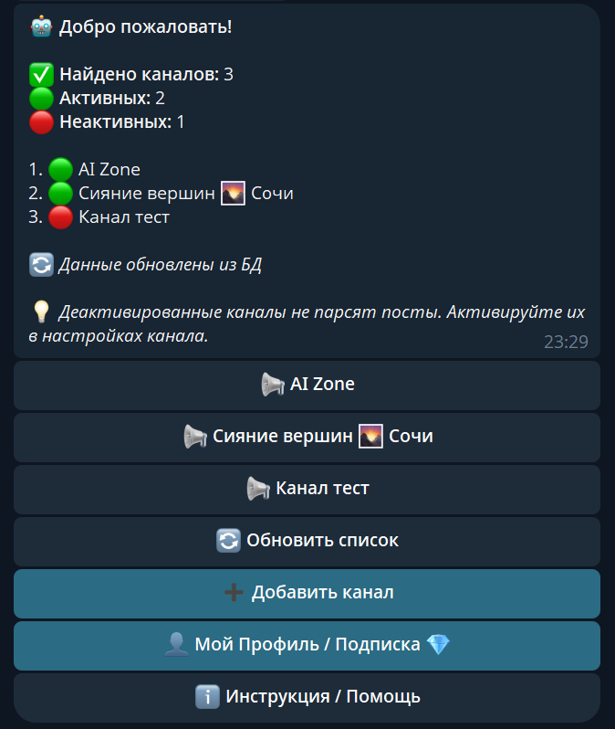
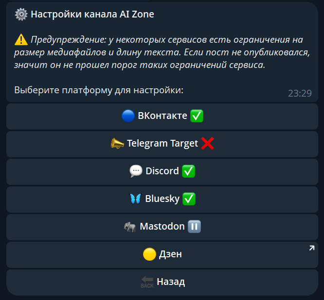
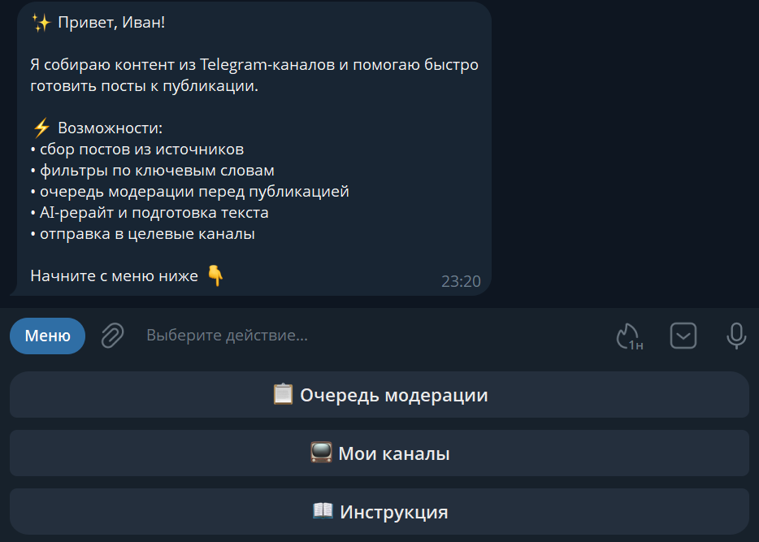
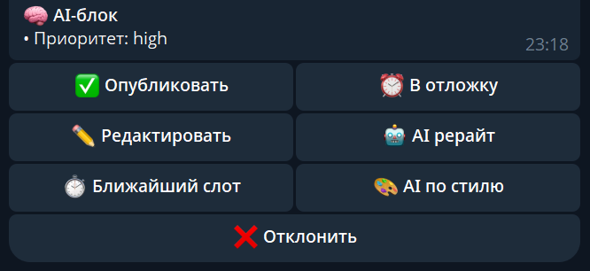
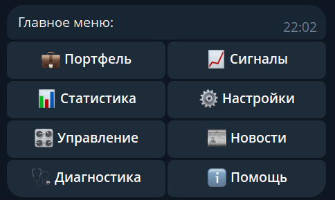
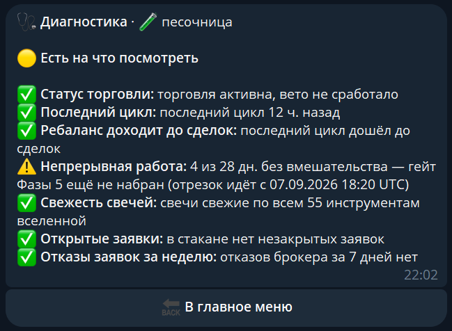
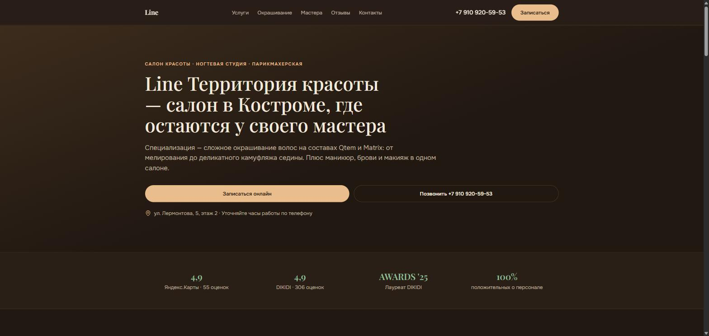
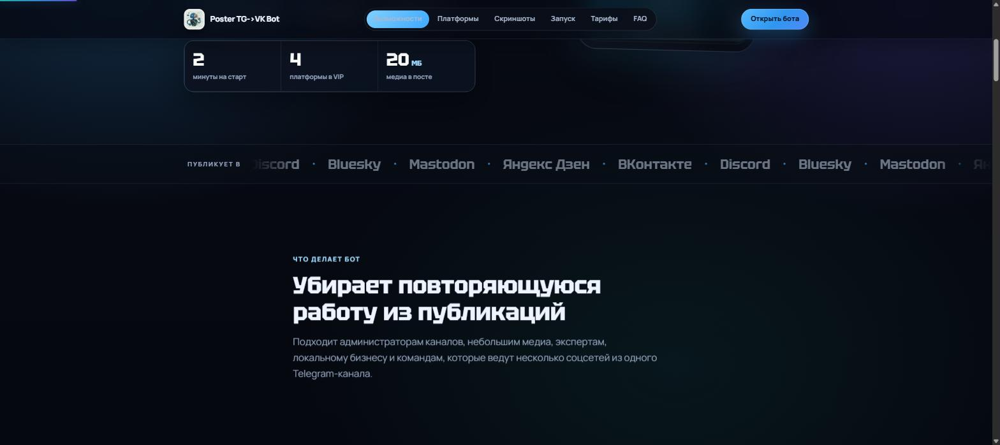

# Портфолио — боты и сайты

**Иван Журавлев** · [Telegram](https://t.me/sochi10) · [сайт-портфолио](https://claude.ai/code/artifact/264aaf2e-b0bf-4c72-a099-282afff8e97c) · k1imber@ya.ru

Три бота ниже работают на серверах прямо сейчас, 24/7. Исходный код закрыт — это коммерческие продукты, поэтому здесь архитектура, возможности и скриншоты, без бизнес-логики.

## Содержание

- [Poster TG→VK Bot](#poster-tgvk-bot)
- [Parser Bot & Content Manager](#parser-bot--content-manager)
- [Торговый бот — Мосбиржа](#торговый-бот--мосбиржа)
- [Сайты](#сайты)

---

## Poster TG→VK Bot

🟢 online · [открыть бота](https://t.me/Poster_TG_VK_bot) · [сайт-визитка](https://poster-bot-site.k1imber.workers.dev/)

Кросспостинг из Telegram-каналов в VK, Telegram, Discord, Bluesky и Mastodon. Переписывает текст через DeepSeek перед публикацией, ведёт отдельную очередь для каждого источника и переживает рестарты без потери настроек.

- Публикует текст, фото, видео и альбомы с сохранением форматирования
- Не дублирует посты; при сбоях отключает только проблемную площадку, а не всё сразу
- Приём оплаты через YooKassa, реферальная система, колесо фортуны, админ-панель с бэкапом БД
- Автоматически деактивирует площадку после серии подряд ошибок и уведомляет владельца

**Стек:** Python · aiogram 3.x · PostgreSQL · DeepSeek API · YooKassa

<table>
<tr>
<td></td>
<td></td>
</tr>
</table>

---

## Parser Bot & Content Manager

🟢 online

Парсит посты из открытых и приватных Telegram-каналов, фильтрует по ключевым словам с учётом падежей и склонений (морфологический анализ), переписывает текст через GigaChat, YandexGPT или DeepSeek на выбор для каждого канала — и не ломает ссылки при рерайте, в отличие от большинства парсеров.

- Распознаёт голосовые сообщения через Whisper и делает из них готовые посты
- Очередь модерации с превью и отложенный постинг на любую дату и время
- Отдельные AI-промпты для каждого канала и каждой нейросети
- Умные функции: приоритеты постов, авто-хештеги, рубрики, объединение похожих тем и дублей

**Стек:** Python · Aiogram 3 · Telethon · SQLite · GigaChat / YandexGPT / DeepSeek · Faster-Whisper · Pymorphy3

<table>
<tr>
<td></td>
<td></td>
</tr>
</table>

---

## Торговый бот — Мосбиржа

🟢 online · sandbox → боевой контур

Полностью автоматизированный алгоритмический трейдинг на T-Invest API (Т-Банк). Факторная модель (momentum, quality, valuation, volatility, liquidity, дивиденды) считает целевые веса портфеля; риск-гварды (kill-switch, дневной лимит потерь, лимит оборота за цикл) останавливают ребаланс целиком при любой аномалии; Telegram-бот присылает ежедневный отчёт и статус.

### Результаты бэктеста

Walk-forward, 2019.06–2026.08 (train 3 года / test 1 год), 26 бумаг + парковка свободного кэша в фонд денежного рынка. Гейт: Sharpe выше бенчмарка при просадке не хуже — по каждому тестовому окну отдельно.

| Метрика | Бот | Бенчмарк MCFTR |
|---|---|---|
| CAGR | **10,68%** | 4,35% |
| Sharpe | **0,716** | 0,301 |
| Max Drawdown | **−27,33%** | −53,53% |

- Бэктестинг с учётом издержек и честным train/test-разделением при подборе параметров
- Единое правило сделок для боевого исполнения и бэктеста — бэктест предсказывает то, что бот сделает вживую
- Управление и отчётность через Telegram: `/stats`, `/health`, `/news`, ручная пауза, план на сегодня без сделок

**Стек:** Python · asyncio · aiogram · T-Invest API · PostgreSQL · SQLAlchemy · Alembic · pandas / numpy · DeepSeek (новости)

<table>
<tr>
<td></td>
<td></td>
</tr>
</table>

---

## Сайты

### Line — Территория красоты

Сайт-визитка салона красоты в Костроме: онлайн-запись, прайс по категориям услуг, состав мастеров. Специализация салона — сложное окрашивание волос на составах Qtem и Matrix.

**Реальные показатели сайта:** 4,9 на Яндекс.Картах (55 оценок) · 4,9 на DIKIDI (306 оценок) · лауреат DIKIDI Awards '25 · 100% позитивных отзывов о персонале.

**Стек:** адаптивная вёрстка · онлайн-запись · Vercel · [открыть сайт](https://line-krasota.vercel.app/)

### Poster TG→VK Bot — сайт-визитка

Лендинг для бота выше: что он умеет, куда публикует, тарифы и ответы на частые вопросы — чтобы человек за минуту понял, нужен ли ему бот, и запустил его в Telegram.

**Стек:** адаптивная вёрстка · Cloudflare Workers · [открыть сайт](https://poster-bot-site.k1imber.workers.dev/)

